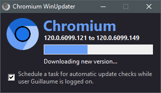

# Chromium WinUpdater
By ltGuillaume: [Codeberg](https://codeberg.org/ltGuillaume) | [GitHub](https://github.com/ltGuillaume) | [Buy me a beer](https://buymeacoff.ee/ltGuillaume) 🍺

An attempt to make updating Chromium for Windows much easier. This is a fork of [LibreWolf WinUpdater](https://codeberg.org/ltGuillaume/librewolf-winupdater).



## Usage
- Chromium WinUpdater currently defaults to [Ungoogled Chromium](https://github.com/macchrome/winchrome/releases) releases by [Marmaduke](https://github.com/macchrome). For support for other Chromium releases, please create an issue with your request.  
- If you want to run the portable version of Chromium, download and extract the latest [`ungoogled-chromium-xxx.x.xxxx.xxx_Win64.7z`](https://github.com/macchrome/winchrome/releases/latest). Put `Chromium-WinUpdater.exe` in the same folder.  
  Then, if you wish to perform an update, just run `Chromium-WinUpdater.exe`.
- When you have installed Chromium using the [xxx.x.xxxx.xxx_ungoogled_mini_installer.exe](https://github.com/macchrome/winchrome/releases/latest), just run `Chromium-WinUpdater.exe` from any location and point to the `chrome.exe` file. If an update is available, the new mini installer will be downloaded and installed.

## Scheduled Updates
- Run Chromium WinUpdater and select the option to automatically check for updates. This will prompt for administrative permissions and a blue (PowerShell) window will open and notify you of the result. The scheduled task will run while the current user account is logged on (at start-up and every 24 hours).
- If your account has administrator privileges, the update will be fully automatic. If not, the update will be downloaded and you will be asked by WinUpdater to start the update.  
- If Chromium is already running, the updater will notify you of the new version. The update will start as soon as you close the browser.

## Remarks
- The updater needs to be able to write to `Chromium-WinUpdater.ini` in its own folder (so make sure it has permission to do so), otherwise WinUpdater will copy itself to `%LocalAppData%\Chromium\WinUpdater` and run from there.
- `Chromium-WinUpdater.ini` contains a `[Log]` section that shows the results of the last update check and update action.
- Chromium WinUpdater also updates itself automatically, so you won't have to check for new releases here. If you prefer to update WinUpdater yourself, add the following to the .ini file:
  ```ini
  [Settings]
  UpdateSelf=0
  ```
- Chromium by default downloads the [Ungoogled Chromium](https://github.com/macchrome/winchrome/releases) release by [Marmaduke](https://github.com/macchrome). You can change the API releases URL in the .ini file (specifically `macchrome` for the GitHub user and `winchrome` for the repository name):
  ```ini
  [Settings]
  ReleaseApiUrl=https://api.github.com/repos/macchrome/winchrome/releases/latest
  ```
  _Obviously, don't add the line `[Settings]` twice_.
- __NOTE:__ Chromium WinUpdater has not yet been tested with other releases, so just try it out and/or ask for help by creating an issue.

## Building
- Requires [7-Zip](https://7-zip.org) console executable ([`7zr.exe`](https://7-zip.org/a/7zr.exe))
- Requires [AutoHotKey 1.1](https://www.autohotkey.com/) \
  See [BUILDING.md](BUILDING.md)

## Credits
* [The Chromium Project](https://www.chromium.org)
* [Original icon](https://github.com/Alex313031/chromium/blob/main/logos/NEW/win/chromium.ico) by Alex Frick
* [Original logo](https://github.com/Alex313031/chromium/blob/main/logos/STAGING/Chromium90_252.jpg) by Alex Frick
