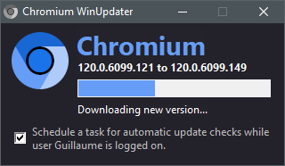

# Chromium WinUpdater
by ltGuillaume: [Codeberg](https://codeberg.org/ltguillaume) | [GitHub](https://github.com/ltguillaume) | [Buy me a beer](https://coff.ee/ltguillaume) 🍺

An attempt to make updating Chromium for Windows much easier. This is a fork of [LibreWolf WinUpdater](https://codeberg.org/ltguillaume/librewolf-winupdater).



## Getting started
### Choosing your release
- WinUpdater by default downloads the 64-bit release of [Ungoogled Chromium by Marmaduke](https://github.com/macchrome/winchrome/releases).
- Alternatively, you can use the (official?) [release by teeminus et al](https://github.com/ungoogled-software/ungoogled-chromium/releases) or [Cromite by uazo](https://github.com/uazo/cromite/releases).
To do this, copy/rename `Chromium-WinUpdater.template.ini` to `Chromium-WinUpdater.ini`, then uncomment the 3 lines of the desired alternative release (by removing the `;`).
  __NOTE:__ WinUpdater has not been tested with other Chromium releases, but you can try changing the three variables yourself and see if it works, or ask for help by creating an [issue](https://codeberg.org/ltguillaume/chromium-winupdater/issues/).
### Chromium Setup
If you have Chromium installed (e.g. via [xxx.x.xxxx.xxx_ungoogled_mini_installer.exe](https://github.com/macchrome/winchrome/releases/latest)), just run `Chromium-WinUpdater.exe` from any location. If an update is available, the new mini installer will be downloaded and installed.
### Chromium Portable
- If you want to run the portable version of Chromium, download and extract the latest release of your choice (e.g. Marmaduke's [`ungoogled-chromium-xxx.x.xxxx.xxx_Win64.7z`](https://github.com/macchrome/winchrome/releases/latest)). Put `Chromium-WinUpdater.exe` in the same folder.
- Then, if you wish to perform an update, just run `Chromium-WinUpdater.exe`.
### Scheduled updates
- When Chromium is __installed__, you can run WinUpdater and select the option to automatically check for updates. This will prompt for administrator permissions and a blue (PowerShell) window will notify you of the result. The scheduled task will run while the _current_ user account is logged in (at 1 minute after login, and every 24 hours).
- If your account has __administrator permissions__, the update will be fully automatic. If not, the update will be downloaded and you will be asked by WinUpdater to start the update (administrator permissions required).
- If Chromium is already __running__, the updater will notify you of the new version. The update will start as soon as you close the browser.

## Settings
### Settings and log file
- The updater needs to be able to write to `Chromium-WinUpdater.ini` in its own folder (so make sure it has permission to do so), otherwise WinUpdater will copy itself to `%LocalAppData%\Chromium\WinUpdater` and run from there.
- `Chromium-WinUpdater.ini` contains a `[Log]` section that shows the results of the last update check and update action.
## Self-updating
Chromium WinUpdater also updates itself automatically, so you won't have to check for new releases here. If you prefer to update it manually, set `UpdateSelf` to `0` in the .ini file under `[Settings]`:
```ini
[Settings]
UpdateSelf=0
```
### Changing the working directory
If for some reason WinUpdater is not able to use the user's default `%Temp%` folder for downloading and extracting files, you can specify an alternative working directory by setting `WorkDir` in the .ini file under `[Settings]`:
```ini
[Settings]
WorkDir=D:\Temp
```
To specify the directory of `Chromium-WinUpdater.exe`, type `WorkDir=.`, or use a relative subfolder like `WorkDir=.\Temp`.

## Issues
### Anti-cheat software
If you set up scheduled updates, you might get annoyed by some anti-cheat software. It may wrongfully point at WinUpdater, because it is built upon AutoHotkey, which _can_ be used to cheat in games. If this happens, you can either:
  1. Open the __Task Scheduler__ via the Start menu, then double-click on `Chromium WinUpdater...` in the `Task Scheduler Library`, open the `Triggers` tab, then click on `One time` and the button `Delete`. Then press `OK` to make the change to _only check for updates 1 minute after login_ (and not every 4 hours). This will still cause issues if you leave games opened when locking your user account, though.
  2. Create a shortcut to `Chromium-Winupdater.exe /RemoveTask` and one to `Chromium-Winupdater.exe /CreateTask` (on your desktop), so you can quickly prevent WinUpdater from running during gameplay and reactivate it afterwards. Just put them next to the shortcuts of your game launchers and you won't forget.
### Server certificate revocation
You may encounter a `Security Alert: Revocation information for the Security certificate for this site is not available` Windows dialog or a `The server certificate revocation check for (...) has failed` warning by WinUpdater. This can happen if you have enabled the non-default option `Check for server certificate revocation` in the Windows `Internet Options` (tab `Advanced`). You can tell WinUpdater to automatically continue when this dialog pops up by setting `IgnoreCrlErrors` to `1` in the .ini file under `[Settings]`:
```ini
[Settings]
IgnoreCrlErrors=1
```

## Building
- Requires [7-Zip](https://7-zip.org/download.html) standalone console version (`7za.exe` from the __7-Zip Extra__ download)
- Requires [AutoHotKey 1.1](https://www.autohotkey.com/) \
  See [BUILDING.md](BUILDING.md)

## Credits
* [The Chromium Project](https://www.chromium.org)
* [Chromium icon](https://github.com/Alex313031/chromium/blob/main/logos/NEW/win/thorium.ico) by Alex Frick
* [Chromium logo](https://github.com/Alex313031/chromium/blob/main/logos/STAGING/Thorium90_252.jpg) by Alex Frick
